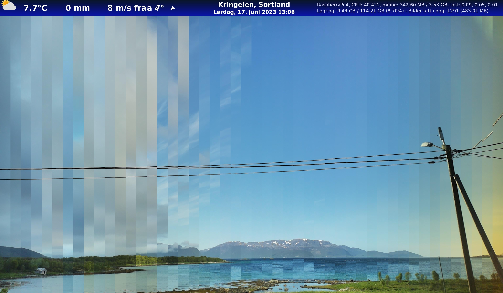

# Raspberry Pi Timelapse

Python3 scripts for capturing images using Raspberry Pi with [libcamera](https://libcamera.org/) and PiCamera v2 or v3.

Be sure to read the [Picamera2 manual](https://datasheets.raspberrypi.com/camera/picamera2-manual.pdf) and see [their github for indepth python usage](https://github.com/raspberrypi/picamera2).

See live demo of my cameras at [https://ekstremedia.no/sortland/live](https://ekstremedia.no/sortland/live).

## Required modules

Using the following python modules, see [requirements.txt](requirements.txt): 
> requests pyyaml argparse colorlog Pillow opencv-python colored picamera2 tqdm psutil python-dateutil prettytable termcolor

Install the required modules for python

     pip install -r requirements.txt

## Config
Copy [example_config.yaml](example_config.yaml) to `config.yaml` and edit it to your specifications.

## Image captures

[capture_image.py](capture_image.py) takes the photo and put on the overlay made in [overlay.py](overlay.py)

    python capture_image.py

[timelapse.py](timelapse.py) will start the timelapse script that runs `capture_image.py` or ``capture_image_night.py` at the interval set in config. Which script is run is determined on the sunrise and sunset times defined in data/sun_data_2023.json. This file currently have the dates and times for my current position. In config.yaml, there are constants defined to help me pinpoint the correct times to run the night script and day script.

The night script will also slowly increase shutter speed and gain over a 1 hour period, after sunset. This is to get the best possible image quality in low light conditions. It also will revert this process 1 hour before sunrise, to slowly drift into day mode. Then, the `capture_image.py` script will be run for the day period, which runs on more automatic settings.

    python timelapse.py
Can be set in crontab to start at boot:

    @reboot timelapse python /home/pi/raspberrypi-picamera-timelapse/timelapse.py

Or as a screen process:

    @reboot screen -dmS timelapse python /home/pi/raspberrypi-picamera-timelapse/timelapse.py

Then you could later resume the screen to see its progress:

    screen -r timelapse
## Create timelapse videos

Requires [ffmpeg](https://ffmpeg.org/) installed.

    sudo apt install ffmpeg

Run [create-timelapse.py](create-timelapse.py) to create a timelapse of yesterday's photos. It will call the [scripts/ffmpeg.py](scripts/ffmpeg.py) script, which is basically running this:

    ffmpeg_settings = [
        ('-y', None),  # Overwrite the output file without asking for confirmation
        ('-framerate', str(config['video_output']['framerate'])),
        ('-pattern_type', 'glob'),
        ('-i', f"{os.path.join(image_folder, '*.jpg')}"),
        ('-s', f"{config['video_output']['video_width']}x{config['video_output']['video_height']}"),
        ('-vf', f"deflicker,setpts=N/FRAME_RATE/TB"),
        ('-c:v', 'libx264'),
        ('-crf', str(config['video_output']['constant_rate_factor'])),
        ('-b:v', str(config['video_output']['bitrate']))
    ]

Specify a date to make timelapse of:

    python create-timelapse.py --date 2023-06-09

To create a test timelapse: 

    create-timelapse.py --date 2023-06-09 --dont-upload --debug

Will create `/var/www/html/public/video-debug/2023_06_09_1920_1160_23.mp4`

Can be set in crontab to automatically run at a specific time, for instance at midnight:

    @midnight python /home/pi/raspberrypi-picamera-timelapse/create-timelapse.py

Too see video specs:

    ffprobe -i /var/www/html/public/video-debug/2023_06_09_1920_1160_23.mp4

## Test scripts
### Day  slice

To create a day slice image with [scripts/daylineImage.py](scripts/daylineImage.py):

    python scripts/daylineImage.py 
        --folder /var/www/html/images/2023/06/17 
        --date 2023-06-17 
        --slices 24

It will create lines of day and put it from left to right as the final image.
`--slices` will define how many lines to put. Example photo has 48, so every line represent 30 minutes.

Will be created in `temp/dayline-2023-06-17.jpg`

### Test upload
To test upload a video:

    python scripts/upload-timelapse-video.py 
        --file /var/www/html/videos/2023/06/timelapse_2023_06_16.mp4 
        --date 2023-06-16
